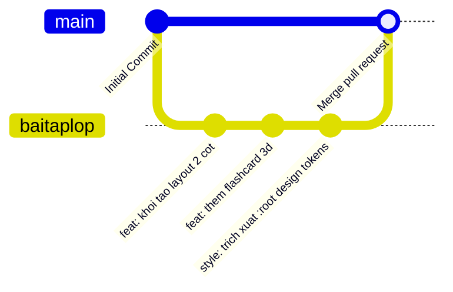

<div align="center">

  <!-- LOGO HOẶC BANNER DỰ ÁN -->
  

  # 🎌 JAPANESE-web
  ### Nền Tảng Học Tiếng Nhật Trực Tuyến & Tương Tác Hiện Đại

  <p align="center">
    <b>Dự án môn học Thiết kế Web — Khoa Công nghệ Thông tin, Trường Đại học Lạc Hồng (LHU)</b>
  </p>

  <!-- SHIELDS.IO BADGES (HUY HIỆU TRẠNG THÁI CHUẨN GITHUB) -->
  <p align="center">
    <a href="https://github.com/DoMinhQuan8386/JAPANESE-web/graphs/contributors"></a>
    <a href="https://github.com/DoMinhQuan8386/JAPANESE-web/network/members"></a>
    <a href="https://github.com/DoMinhQuan8386/JAPANESE-web/stargazers"></a>
    <a href="https://github.com/DoMinhQuan8386/JAPANESE-web/issues"></a>
    <a href="https://github.com/DoMinhQuan8386/JAPANESE-web/blob/main/LICENSE"></a>
  </p>

  <!-- TECH STACK BADGES -->
  <p align="center">
    
    
    
    
    
  </p>

  <!-- LIÊN KẾT NHANH -->
  <p align="center">
    <a href="#-tổng-quan-dự-án">Khám phá Dự án</a> •
    <a href="#-tính-năng-nổi-bật">Tính năng</a> •
    <a href="#-cài-đặt--chạy-thử">Cài đặt</a> •
    <a href="#-quy-trình-git--đóng-góp">Quy trình Git</a> •
    <a href="#-thành-viên-phát-triển">Nhóm Tác giả</a>
  </p>

</div>

---

## 📖 Mục Lục

- [🌟 Tổng Quan Dự Án](#-tổng-quan-dự-án)
- [🎯 Mục Tiêu Đề Tài](#-mục-tiêu-đề-tài)
- [✨ Tính Năng Nổi Bật](#-tính-năng-nổi-bật)
- [🛠️ Công Nghệ Sử Dụng (Tech Stack)](#️-công-nghệ-sử-dụng-tech-stack)
- [📂 Cấu Trúc Thư Mục (Directory Structure)](#-cấu-trúc-thư-mục-directory-structure)
- [🚀 Cài Đặt & Chạy Thử (Getting Started)](#-cài-đặt--chạy-thử-getting-started)
- [🎨 Bảng Mã Màu & Design System (Design Tokens)](#-bảng-mã-màu--design-system-design-tokens)
- [🌿 Quy Trình Làm Việc Với Git (Git Workflow)](#-quy-trình-làm-việc-với-git-git-workflow)
- [👥 Thành Viên Phát Triển (Team Members)](#-thành-viên-phát-triển-team-members)
- [📄 Giấy Phép & Bản Quyền (License)](#-giấy-phép--bản-quyền-license)

---

## 🌟 Tổng Quan Dự Án

**JAPANESE-web** là dự án website học tiếng Nhật trực quan, được thiết kế và phát triển nhằm giúp sinh viên và người mới bắt đầu học tiếng Nhật tiếp cận bảng chữ cái, từ vựng và ngữ pháp JLPT (N5 - N3) một cách dễ hiểu, hứng khởi và hiệu quả nhất.

> [!NOTE]
> Dự án được xây dựng trong khuôn khổ học phần **Thiết kế Web**, Khoa **Công nghệ Thông tin** - **Trường Đại học Lạc Hồng (LHU)**.

### 💡 Vấn đề giải quyết:
- Giảm bớt sự khô khan khi học hai bảng chữ cái Hiragana & Katakana thông qua các thẻ tương tác và hiệu ứng lật 3D.
- Ứng dụng phương pháp ghi nhớ lặp lại ngắt quãng (Spaced Repetition Flashcards).
- Giao diện tối ưu chuẩn WCAG, hỗ trợ đầy đủ chế độ Sáng/Tối (Light/Dark Mode) và tương thích mọi kích thước màn hình từ Desktop đến Smartphone.

---

## 🎯 Mục Tiêu Đề Tài

1. **Về mặt học thuật**: Áp dụng kiến thức Semantic HTML5, CSS3 Grid/Flexbox, CSS Variables (`:root`), JavaScript ES6+ và Responsive Media Queries vào sản phẩm thực tế.
2. **Về mặt thẩm mỹ UI/UX**: Xây dựng nhận diện thương hiệu mang đậm phong cách Nhật Bản tinh tế (Màu đỏ Torii `#d70026`, Cam san hô `#e76f51`, hoa văn Seigaiha, hiệu ứng cánh hoa anh đào Sakura).
3. **Về mặt kỹ năng nhóm**: Thực hành làm việc nhóm chuyên nghiệp trên GitHub: phân chia nhánh `main`, nhánh phát triển `baitaplop`, quy chuẩn Commit và giải quyết conflict.

---

## ✨ Tính Năng Nổi Bật

| STT | Phân hệ / Module | Chi tiết chức năng | Trạng thái |
|:---:|---|---|:---:|
| 1 | **Bảng chữ cái tương tác** | Bảng Hiragana & Katakana phân theo hàng nguyên âm; hỗ trợ nghe phát âm và xem thứ tự nét viết. | ✅ Hoàn thành |
| 2 | **Flashcard 3D Lật mặt** | Thẻ bài ghi nhớ từ vựng hiệu ứng lật 3D (Mặt trước: Kanji/Kana; Mặt sau: Romaji, Nghĩa tiếng Việt, ví dụ câu). | ✅ Hoàn thành |
| 3 | **Trắc nghiệm phản xạ** | Mini quiz ôn tập từ vựng, tính điểm tự động và phản hồi đáp án tức thì. | 🔄 Đang nâng cấp |
| 4 | **Hồ sơ thành viên (Profile Pages)** | Trang giới thiệu cá nhân từng thành viên nhóm (Ví dụ: `thao-index.html`) chuẩn Responsive 2 cột -> 1 cột. | ✅ Hoàn thành |
| 5 | **Design System & Dark Mode** | Toàn bộ màu sắc và khoảng cách quản trị qua CSS Variables; chuyển đổi Sáng/Tối lưu qua `localStorage`. | ✅ Hoàn thành |
| 6 | **Hiệu ứng Sakura rơi** | Canvas hiệu ứng cánh hoa anh đào bay lãng mạn có nút bật/tắt tiện lợi. | ✅ Hoàn thành |
| 7 | **Xuất / In CV (Print Mode)** | Tối ưu `@media print` cho phép in hoặc lưu PDF hồ sơ chuẩn A4 với một cú nhấp chuột. | ✅ Hoàn thành |

---

## 🛠️ Công Nghệ Sử Dụng (Tech Stack)

### Frontend Core
- **HTML5**: Cấu trúc ngữ nghĩa chuẩn (Semantic Tags: `header`, `nav`, `main`, `aside`, `section`, `article`, `footer`).
- **CSS3 Modern**: CSS Variables / Design Tokens, Flexbox, CSS Grid, Transitions, Keyframe Animations, Media Queries.
- **Vanilla JavaScript (ES6+)**: DOM Manipulation, Event Listeners, Canvas API, Web Storage (`localStorage`), Clipboard API.

### Thư viện & Tài nguyên
- **Font chữ**: Google Fonts ([Plus Jakarta Sans](https://fonts.google.com/specimen/Plus+Jakarta+Sans), [Noto Sans JP](https://fonts.google.com/specimen/Noto+Sans+JP)).
- **Biểu tượng (Icons)**: [Font Awesome 6.5](https://fontawesome.com/).
- **Thiết kế giao diện**: [Figma](https://www.figma.com/).

### Quản lý mã nguồn & Môi trường
- **Version Control**: Git & GitHub.
- **Môi trường phát triển**: VS Code, Antigravity IDE, Live Server.

---

## 📂 Cấu Trúc Thư Mục (Directory Structure)

```text
JAPANESE-web/
├── 📄 index.html              # Trang chủ chính của nền tảng JAPANESE-web
├── 📄 thao-index.html         # Trang Profile cá nhân của Lương Minh Thảo
├── 📄 README.md               # Tài liệu giới thiệu dự án chuẩn GitHub
├── 📁 assets/                 # Thư mục tài nguyên đa phương tiện
│   ├── 📁 css/
│   │   ├── style.css          # Phong cách giao diện chính
│   │   └── dark-mode.css      # Cấu hình giao diện Dark Mode
│   ├── 📁 js/
│   │   ├── main.js            # Xử lý logic chung & flashcard
│   │   └── sakura.js          # Hiệu ứng cánh hoa anh đào Canvas
│   └── 📁 images/
│       ├── logo.png           # Logo dự án
│       ├── banner.png         # Ảnh bìa giới thiệu
│       └── avatars/           # Ảnh đại diện thành viên nhóm
└── 📁 docs/                   # Tài liệu môn học, báo cáo tiến độ & slide
```

---

## 🚀 Cài Đặt & Chạy Thử (Getting Started)

Dự án sử dụng thuần **HTML/CSS/JavaScript**, không yêu cầu cài đặt môi trường backend phức tạp.

### 1. Sao chép mã nguồn (Clone Repository)
```bash
# Clone repo từ GitHub
git clone https://github.com/DoMinhQuan8386/JAPANESE-web.git

# Chuyển vào thư mục dự án
cd JAPANESE-web
```

### 2. Chuyển sang nhánh bài tập lớp (Branch `baitaplop`)
```bash
git checkout baitaplop
```

### 3. Chạy trang web
- **Cách 1: Mở trực tiếp**  
  Nhấp đúp chuột vào tệp `index.html` hoặc `thao-index.html` để mở trên bất kỳ trình duyệt nào (Chrome, Edge, Firefox).
- **Cách 2: Sử dụng VS Code Live Server**  
  Nhấp chuột phải vào `index.html` chọn **Open with Live Server** (cổng mặc định `http://127.0.0.1:5500`).

---

## 🎨 Bảng Mã Màu & Design System (Design Tokens)

Dự án áp dụng chặt chẽ hệ thống biến màu tại `:root`:

| Tên biến CSS | Mã màu | Minh họa trực quan |
|---|:---:|:---:|
| `--color-primary` | `#d70026` |  **Đỏ Torii truyền thống** |
| `--color-secondary` | `#e76f51` |  **Cam san hô ấm áp** |
| `--color-gray-dark` | `#2b2d42` |  **Xám đậm văn bản** |
| `--color-gray-medium` | `#555f6d` |  **Xám trung bình nhãn** |
| `--color-bg-base` | `#fff5f5` |  **Nền trang Sakura** |
| `--color-success` | `#10b981` |  **Xanh lá trạng thái** |

---

## 🌿 Quy Trình Làm Việc Với Git (Git Workflow)

Nhóm áp dụng mô hình phân nhánh và quy chuẩn viết commit theo **Conventional Commits**:



### Tiêu chuẩn Commit Message:
- `feat:` Thêm tính năng mới (ví dụ: `feat: them widget flashcard tieng Nhat`)
- `fix:` Sửa lỗi giao diện hoặc chức năng (ví dụ: `fix: loi responsive mobile duoi 768px`)
- `style:` Tối ưu CSS, căn chỉnh mã màu, spacing (ví dụ: `style: trich xuat bien CSS tai :root`)
- `docs:` Cập nhật tài liệu `README.md` hoặc ghi chú môn học
- `refactor:` Tái cấu trúc mã nguồn nhưng không đổi tính năng

---

## 👥 Thành Viên Phát Triển (Team Members)

<div align="center">
  <table>
    <tr>
      <td align="center" width="220px">
        <a href="https://github.com/DoMinhQuan8386">
          <br />
          <b>Lương Minh Thảo</b>
        </a>
        <br />
        <sub>Sinh viên Khoa CNTT - ĐH Lạc Hồng</sub>
        <br />
        <small>🎨 <b>Vai trò</b>: UI/UX Designer & Front-end Developer</small>
        <br />
        <small>Trang cá nhân: <a href="./thao-index.html">thao-index.html</a></small>
      </td>
      <td align="center" width="220px">
        <a href="https://github.com/DoMinhQuan8386">
          <br />
          <b>Đỗ Minh Quân</b>
        </a>
        <br />
        <sub>Sinh viên Khoa CNTT - ĐH Lạc Hồng</sub>
        <br />
        <small>💻 <b>Vai trò</b>: Team Leader & Full-stack Developer</small>
        <br />
        <small>GitHub: <a href="https://github.com/DoMinhQuan8386">@DoMinhQuan8386</a></small>
      </td>
    </tr>
  </table>
</div>

---

## 📄 Giấy Phép & Bản Quyền (License)

Dự án được phân phối dưới giấy phép mã nguồn mở **MIT License**. Bạn có thể tự do tham khảo, học tập và phát triển thêm. Xem chi tiết tại [LICENSE](LICENSE).

---

<div align="center">
  <b>⭐ Đừng quên nhấn STAR cho Repository nếu dự án hữu ích với bạn! ⭐</b>
  <br />
  <sub>© 2026 JAPANESE-web Team | Khoa CNTT — Trường Đại học Lạc Hồng (LHU)</sub>
</div>
